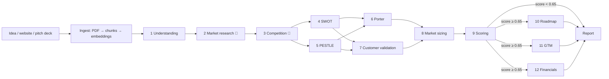

# VenturesLab

**Twelve AI agents review a startup idea the way a venture-capital fund would.**
Give it a one-paragraph description, a website or a pitch-deck PDF. It researches the market and
competitors, runs SWOT, PESTLE and Porter's Five Forces, sizes the market bottom-up, scores the
venture and, if the score is high enough, drafts an MVP roadmap, go-to-market plan and financial model.

[](https://github.com/AshmitCajla/VenturesLab/actions/workflows/ci.yml)
**Live demo:** _add your Streamlit URL here after deploying_

## How it works



* **Orchestration**: a LangGraph state machine with three parallel phases and a conditional branch;
  execution agents only run for ventures that score BUILD.
* **Retrieval (RAG)**: pitch decks are split into overlapping chunks and embedded with
  `bge-small-en-v1.5` (ONNX, CPU). Each agent retrieves only the slides relevant to *its* question;
  the financial agent, for example, asks about revenue, burn and pricing.
  In-memory by default; Qdrant is used automatically when `QDRANT_URL` is set.
* **Live web research** for the market and competition agents (🔎).
* **Structured outputs**: every agent must return a Pydantic schema via tool calling.
* **Deterministic scoring**: the LLM rates five criteria from 1 to 10. The final score is a fixed
  weighted sum computed in code (20/25/25/10/20), so BUILD / PIVOT / PASS decisions are reproducible
  and explainable.
* **Provider fallback**: Groq first, then OpenRouter automatically if the first provider errors or is rate-limited.

## Evaluation and self-correction

Schemas only guarantee *shape*. `backend/evaluation/checks.py` adds 20+ checks for outputs that are
well-formed but wrong, based on failure modes seen during development:

| agent | example checks |
|---|---|
| Market sizing | TAM ≥ SAM ≥ SOM; SOM ≤ 20% of TAM; at least 3 explicit assumptions |
| Competition | 3-7 competitors, no duplicates, the venture is not listed as its own competitor |
| Customer validation | a "nice to have" label cannot come with a 9/10 pain score |
| SWOT | every quadrant filled, no point repeated across quadrants |
| Financials | year-5 revenue ≥ year-1; year-5 revenue within the obtainable market |

A failed `error`-level check sends the agent **one self-correction retry** with the failure
explained in the prompt. All results are returned with the analysis and shown in the UI's
*Quality & trace* tab.

`python -m evaluation.run_eval` runs the whole pipeline over labelled cases in
`evaluation/cases.json`. For each agent it reports latency, retries, errors and check pass rate,
and it checks each verdict against the range a reviewer expected. Results go to `evaluation/report.md`.

## Engineering

* **Async job API**: a full run takes minutes, longer than most free hosts allow for one request.
  `POST /analyze` returns a job id at once, and the UI polls `GET /jobs/{id}` to show each agent finishing.
* **Failure isolation**: one agent failing is recorded and its dependents are skipped. The rest of the report is still produced.
* **Guard rails**: upload size and type checks, SSRF protection on website scraping (only public
  http(s) addresses), a limit on concurrent jobs, and secrets only from environment variables.
* **Tests**: 14 offline tests with a deterministic fake LLM. They cover the full graph, conditional routing,
  self-correction, failure isolation, RAG context delivery, the API job lifecycle and SSRF blocking.
  CI runs lint, tests, the evaluation harness and both Docker builds on every push.

## Run locally

```bash
cp backend/.env.example backend/.env      # add GROQ_API_KEY (free at console.groq.com)

# option A: docker
docker compose up --build                 # UI on http://localhost:8501

# option B: plain python
cd backend && pip install -r requirements-dev.txt && uvicorn main:app --reload
cd frontend && pip install -r requirements.txt && streamlit run app.py
```

Tests: `cd backend && pytest -q`

## Deploy (free tier)

1. **Backend → Render**: New → Blueprint → select this repo (uses `render.yaml`). Set `GROQ_API_KEY`.
   (Alternatively a Docker Hugging Face Space: the Dockerfile listens on port 7860.)
2. **Frontend → Streamlit Community Cloud**: New app → this repo → main file `frontend/app.py`.
   Under *Secrets* add `BACKEND_URL = "https://<your-render-service>.onrender.com"`.

Free Render services sleep when idle, so the first request can take about 30 seconds.

## Project layout

```
backend/
  main.py              FastAPI app and job runner
  workflow/            LangGraph graph and shared state
  agents/              12 agents (declarative AgentSpec + shared base)
  evaluation/          quality checks, labelled cases and evaluation harness
  services/            documents, retrieval, web search, storage
  core/                config, model router, embeddings
  tests/
frontend/
  app.py               Streamlit UI
  report.py            PDF export
```

## Limitations

LLM market numbers are estimates. The system is a structured first pass for a founder or analyst,
not investment advice. Web search results vary between runs.
